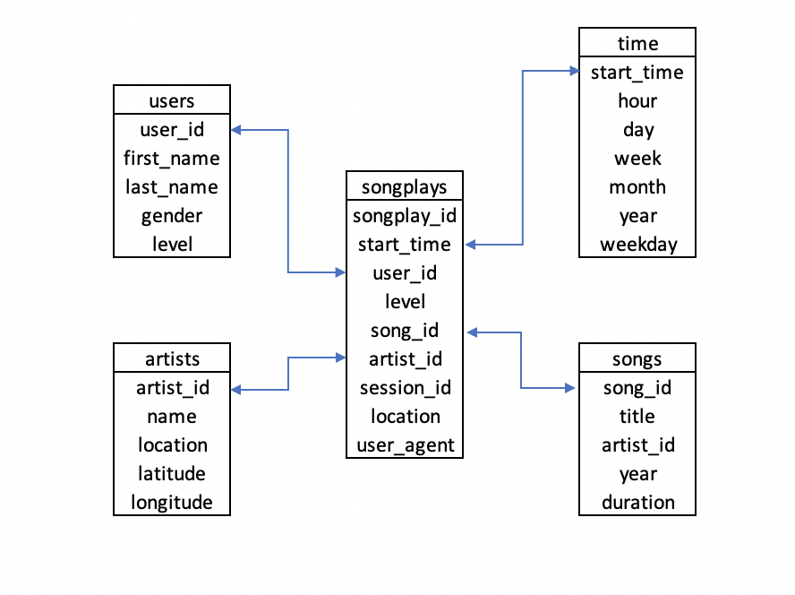

## Project 1: Data Modeling with Postgres

#### Introduction
This project is to define fact and dimension tables for a star schema, and write an ETL pipeline that transfers data from files in two local directories into these tables in Postgres using Python and SQL.

#### Database Schema
Please refer to the below star schema.


#### ETL Pipeline
* Create a database called sparkifydb
* Create tables as needed based on the star schema
* Load and transform the data from json files (log_data and song_data)
* Insert the data to the corresponding tables
* Test the database

#### Example Queries
<I> How many songs does an artist have on Sparkify?
</I>
``` SQL
SELECT artist_id, count(song_id) FROM songs group by artist_id LIMIT 5;
```
